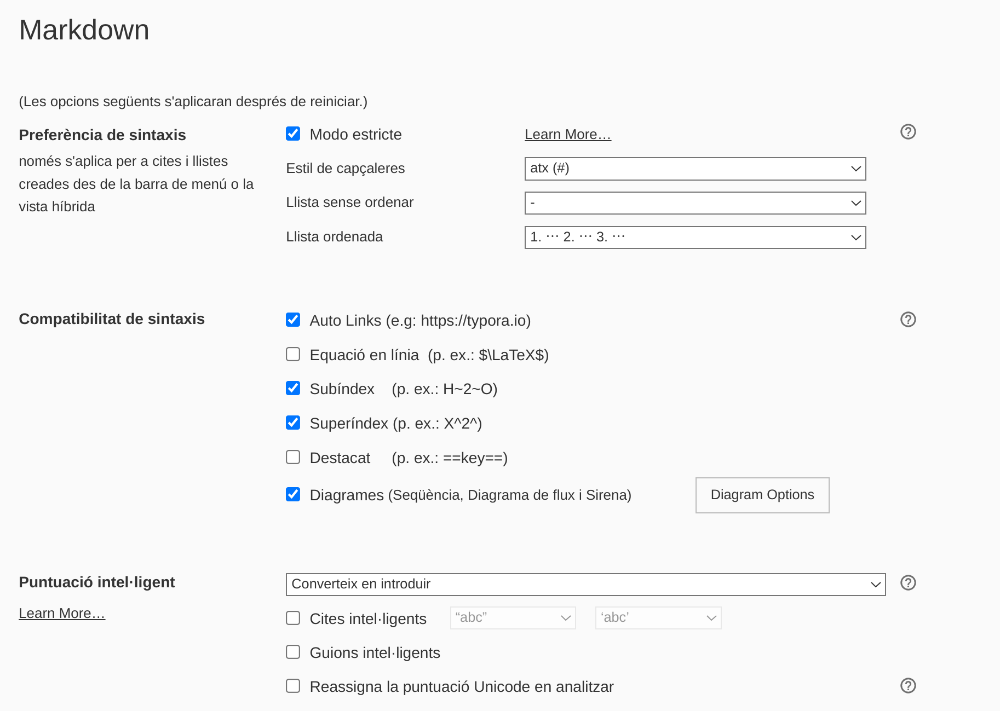
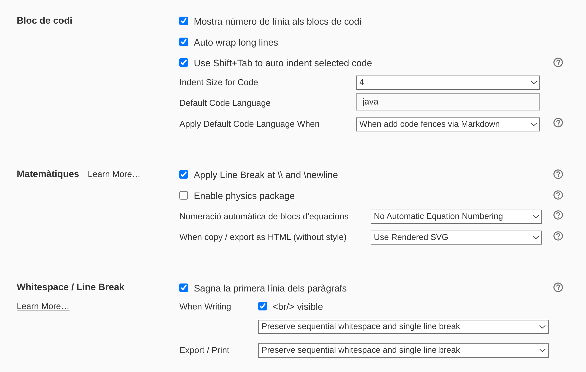
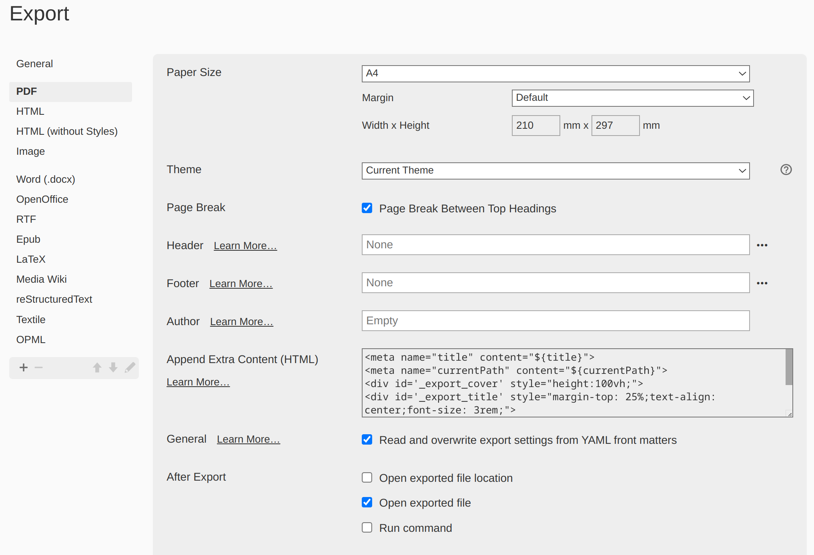

# Tool needed

To edit and export my markdown files I'm using [Typora](https://typora.io/)

#  Typora settings

In the `File`>`Preferences`>`Markdown` menu I've changed the following settings:



and...



In the `File`>`Preferences`>`Export` menu I've changed the following settings:



The `Append Extra Content (HTML)` setting is for the cover (image, title, etc.):

```html
<meta name="title" content="${title}">
<meta name="currentPath" content="${currentPath}">
<div id='_export_cover' style="height:100vh;">
<div id='_export_title' style="margin-top: 25%;text-align: center;font-size: 3rem;">
</div></div>
<script>
    var $cover = document.querySelector("#_export_cover");
    var title = document.querySelector("meta[name='title']").getAttribute("content");
    var currentPath = document.querySelector("meta[name='currentPath']").getAttribute("content");
    document.body.insertBefore($cover, document.body.childNodes[0])
    $cover.querySelector("#_export_title").textContent = title;
    document.getElementById("imgcover").src=currentPath+'/../assets/cover.png';
</script>
```

This setting will put the title from the Font-matter tag, and the cover from the path in Font-matter and adding `/../assets/cover.png`

# Font-matter

At the top of each document you will find a font-matter section:

```markdown
---
title: UD08: Composición, Herencia y Polimorfismo
language: ES
author: David Martínez Peña [www.martinezpenya.es]
subject: Programación
keywords: [PRG, 2021, Programacion, Java]
IES: IES Eduardo Primo Marqués (Carlet) [ieseduar.es]
header: ${title} - ${subject} (ver: ${today})
footer:${currentFileName}.pdf - ${author} - ${IES} - ${pageNo}/${pageCount}
typora-root-url:${filename}/../
typora-copy-images-to:${filename}/../assets
---
```

This snippet will specify:

| Tag                   | Description                                                  |
| --------------------- | ------------------------------------------------------------ |
| title                 | the title of the document for the cover and the header       |
| language              | specify the main language of the document                    |
| author                | the author of the document, will be used in the footer       |
| subject               | main subject of the document for the Meta Information        |
| keywords              | keywords of the document for the Meta Information in the pdf |
| IES                   | special tag for the name of the institute for the footer     |
| header                | with title, subject and todays date                          |
| footer                | with name of the file, author, IES, actual page and total pages |
| typora-root-url       | specify the root url for typora                              |
| typora-copy-images-to | defines the default location of imagen when we copy image to typora |

# Theme

I've made a special theme based on Typora's theme to match my needs. For example, numbering headers (in content and TOC), coloring notes in red, etc. You can find this theme [here](assets/david.css) (`David.css`).

To use this theme you must put it in your `Typora Theme's folder` and select it to show on preview and/or export.

# License

[fromMD2PDF](https://github.com/martinezpenya/fromMD2PDF) © 2021   by  [ David Martinez ](http://www.martinezpenya.es) is licensed under [ Attribution-NonCommercial-ShareAlike 4.0 International ](http://creativecommons.org/licenses/by-nc-sa/4.0/?ref=chooser-v1)

